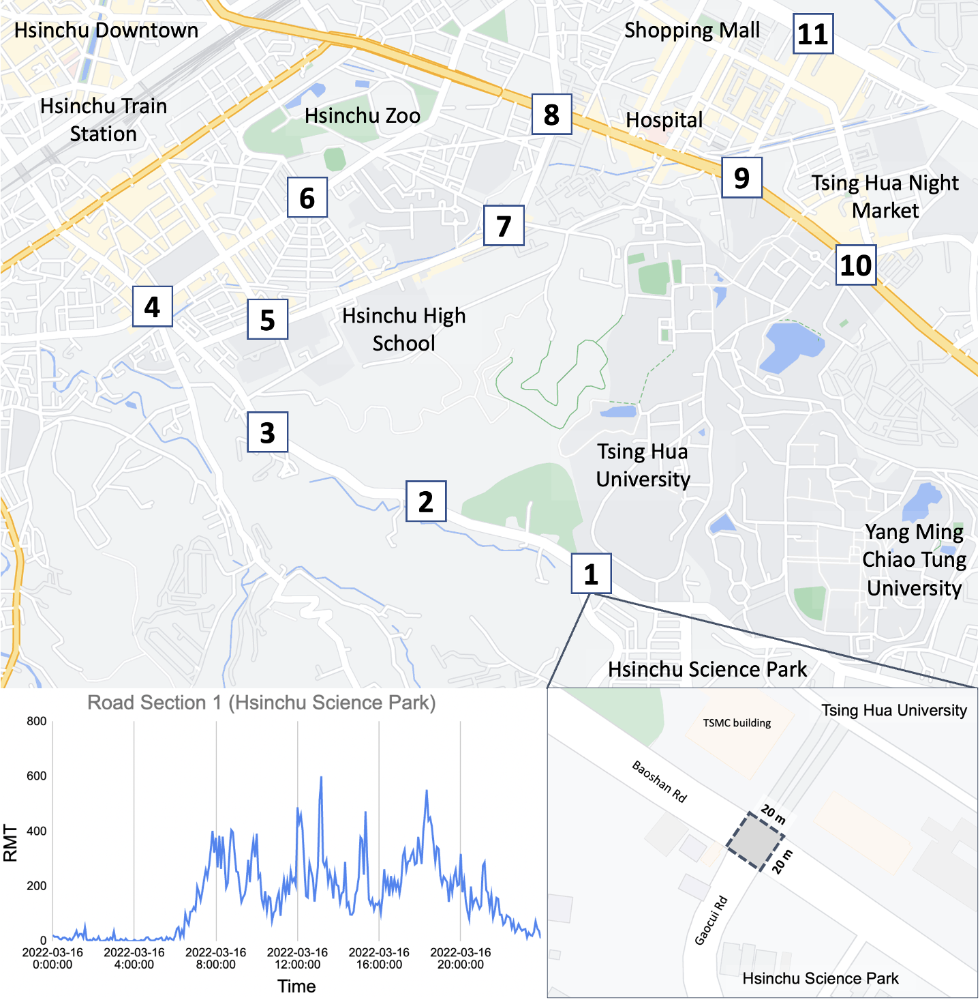
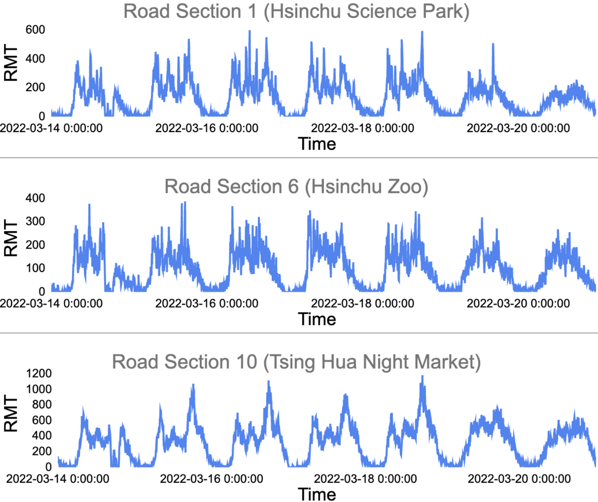

# RMT-dataset for VLDB'23 Vol. 16

This is the RMT dataset used in VLDB'23 Vol16 (Model Codes will be made public after the inspection of Chunghwa Telecom). 
This prototypical dataset cooperated with [Chunghwa Telecom Company](https://www.cht.com.tw/en/home/cht), the largest telecommunication company in Taiwan with over 10 million mobile subscribers and accounted for over 50% population.

## RMT(Road Mobile Traffic) Definition
RMT is defined as the accumulated quantity of cellular traffic in a time interval within a road section, which can reflect crowdedness in a region.

We collected cellular traffic from Chunghwa Telecom's cellular traffic storage database, which received and stored over 2 billion daily mobile user cellular traffic records.

*Please note:*: 
Due to privacy considerations, only employed authors can access the database, and all cellular records are anonymized by hashing before aggregating as RMT.

## RMT Dataset Introduction
We proposed a new spatial-temporal dataset, the RMT Dataset, consisting of RMT time series among multiple road sections. 
These road sections are geographically connected to constitute a network, generating more spatial correlations. 
Hence, RMT Dataset combines the mobility of mobile users into road section topology, resulting in more spatial-temporal potential.

### Spatial Information
Road Sections in Hsinchu City, Taiwan.

### Temporal Information
Examples of RMT time series.

## Dataset Providing

### (1). Graph Structure of Road Section Network
As the implementation is based on pre-calculated distances between road sections, we provided the CSV file with road section distances and IDs in the following link: [Road Section Distance](https://drive.google.com/file/d/1T4SAfwdLSAtR6hcPL-BmHzbEjdtlJEfc/view?usp=share_link). To generate the Graph Structure based on the "Road Section Distance" file provided above, please execute the [script](https://github.com/liyaguang/DCRNN/blob/master/scripts/gen_adj_mx.py). 

The Graph Structure of the Road Section Network used in experiments is provided in the following link: [Graph Structure of Road Section Network](https://drive.google.com/file/d/1pWSCuEsGLT93ggR3asCeOVuuX5btliOR/view?usp=share_link)   

### (2). The Processed RMT dataset
The original csv file of RMT dataset are available at [RMT_2022_nodes_11.csv](https://drive.google.com/file/d/13ngpCDl27PQh9kkbj5OUtgy3bamOUWae/view?usp=share_link). Here are the part examples:

|                     | Road Section 1 | Road Section 2 | Road Section 3 | ... | Road Section N |
|:-------------------:|:--------------:|:--------------:|:--------------:|:--------------:|:--------------:|
| 2022-01-01 0:00:00 |   24.0        |   1.0        |   16.0        |    ...         |    37.0         |
|         ...         |    ...         |    ...         |    ...         |    ...         |    ...         |
| 2022-03-16 18:00:00 |   330.0        |   43.0        |   322.0        |    ...         |    269.0         |
| 2022-03-16 18:05:00 |   281.0        |   42.0        |   348.0        |    ...         |    212.0         |
| 2022-03-16 18:10:00 |   401.0        |   70.0         |   240.0        |    ...         |    289.0         |
|         ...         |    ...         |    ...         |    ...         |    ...         |    ...         |
| 2022-03-31 23:55:00 |   54.0        |   9.0        |   51.0        |    ...         |    38.0         |

To generate train/test/val dataset as  `{train,val,test}.npz` for the experiments, please follow the reference [script](https://github.com/liyaguang/DCRNN/blob/master/scripts/generate_training_data.py)

The processed train/val/test data structures are available at: [train/test/val data](https://drive.google.com/drive/folders/13ERd3wZFOe41RJ8CXyg_Q9U5XaS_HYrz?usp=share_link)

### (3). Feature Augmentation
We adopted our proposed Feature Augmentation to convert the univariate feature (e.g., traffic speed / Traffic Flow / RMT) into multivariate features with the linear and nonlinear components, enhancing the diversity of dataset.

The linear and nonlinear components we employed are Mean Average and Geometric Average, provided at [Linear & Nonlinear Components](https://drive.google.com/drive/folders/1NrRM7VW48XgOVr9dV2hW4thh5VR1XqdF?usp=share_link). 

### (4). The data of Hashed Table

We will provide the hashed cellular traffic in the following link: [Hashed Cellular Traffic](https://drive.google.com/drive/folders/15aN_zvN6qDEbpQBIIlQ7BBQOvwLoaqnq?usp=share_link)   

## Urban Computing Applications

